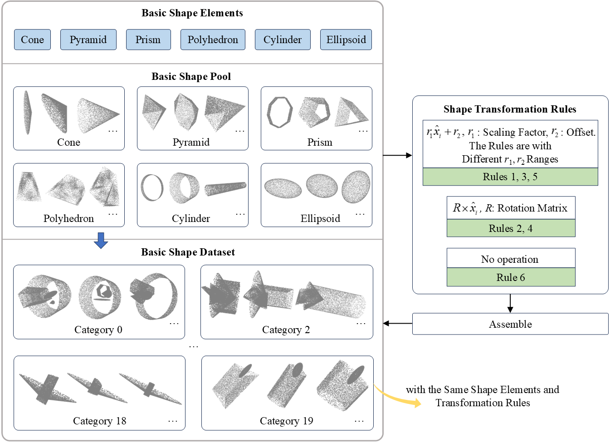

# BSA-CIL-3D
Boosting the Class-Incremental Learning in 3D Point Clouds via Zero-Collection-Cost Basic Shape Pre-Training.

## 📖Content
- [BSA Dataset](#BSA-Dataset)
- [Pretrained Models](#Pretraining-Models)
- [Code](#Code)

## 🎨BSA Dataset

## 🌈Pretrained Models

## 💻Code
